# Architecture Documentation

This document describes the architecture of the AI Coding Evaluation Framework.

---

## System Overview

The framework consists of 20 independent benchmarks, each with a standardized structure, verification system, and scoring mechanism. All benchmarks output JSON for automated analysis and leaderboard generation.

---

## High-Level Architecture

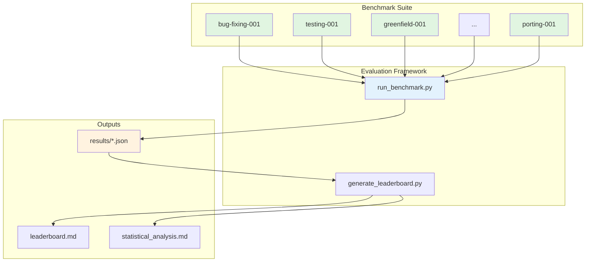

---

## Benchmark Structure

Each benchmark follows a standardized directory structure:

```
benchmark-name/
├── README.md              # Overview and usage instructions
├── spec.md               # Detailed task specification for AI
├── prompts.txt           # Standardized prompt format
├── starter-code/         # Initial codebase (if applicable)
│   ├── src/             # Source code to modify
│   ├── tests/           # Existing tests (may be incomplete)
│   └── requirements.txt # Dependencies
├── data/                 # Sample data (if applicable)
│   └── sample_data.csv
├── verification/         # Automated verification system
│   ├── verify.sh        # Main verification script
│   ├── tests/           # Comprehensive test suite
│   ├── check_*.py       # Code quality checkers
│   └── reference_output.json
└── reference-solution/   # Hidden from AI during evaluation
    └── solution.py
```

---

## Benchmark Execution Flow

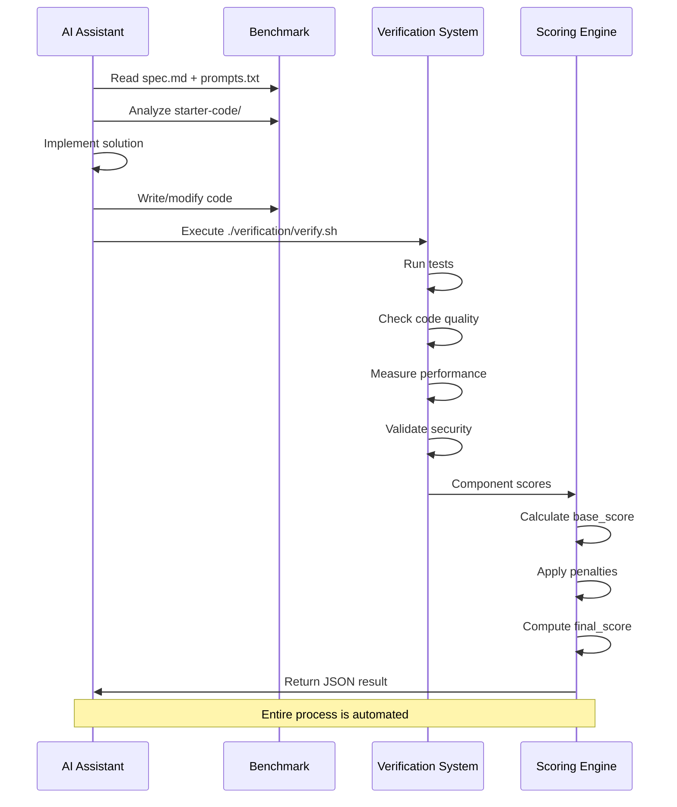

---

## Verification System Architecture

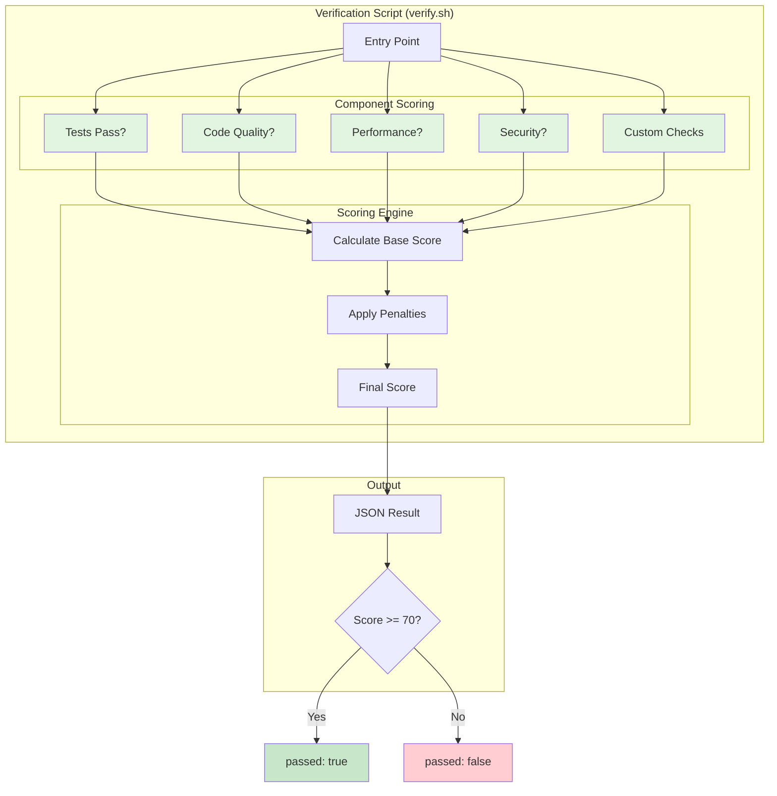

---

## Scoring Formula

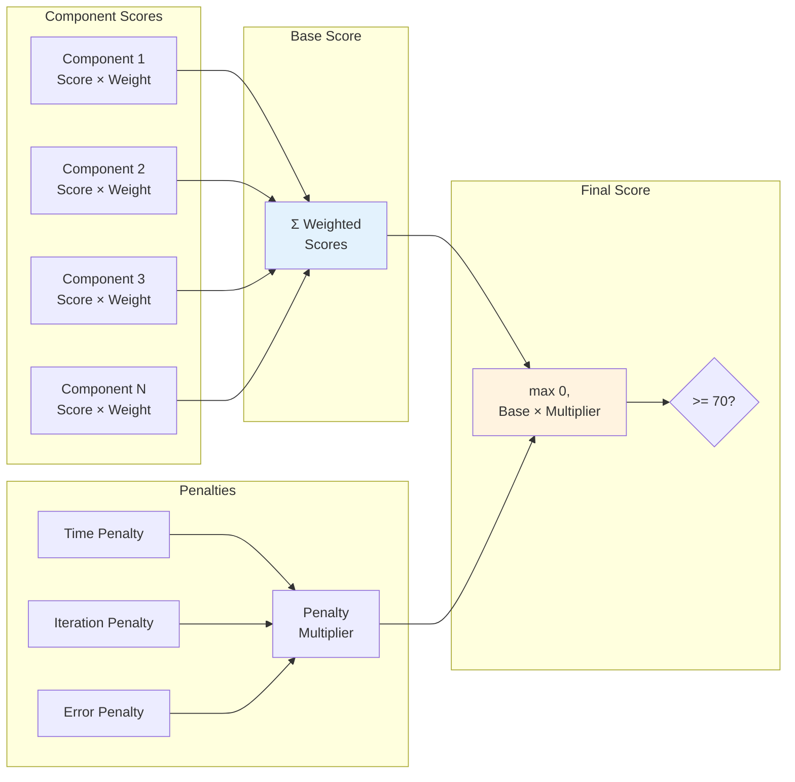

**Formula:**
```
Base Score = Σ(Component Score × Component Weight)
Penalty Multiplier = 1.0 - (time_penalty + iteration_penalty + error_penalty)
Final Score = max(0, Base Score × Penalty Multiplier)
Passed = Final Score >= 70
```

---

## Benchmark Categories & Coverage

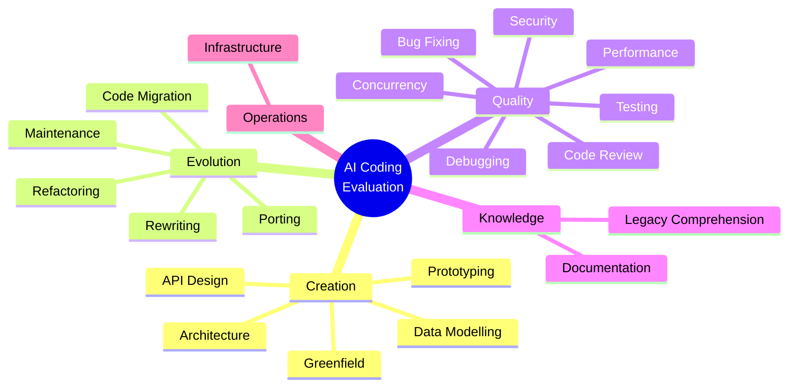

---

## Example: security-001 Architecture

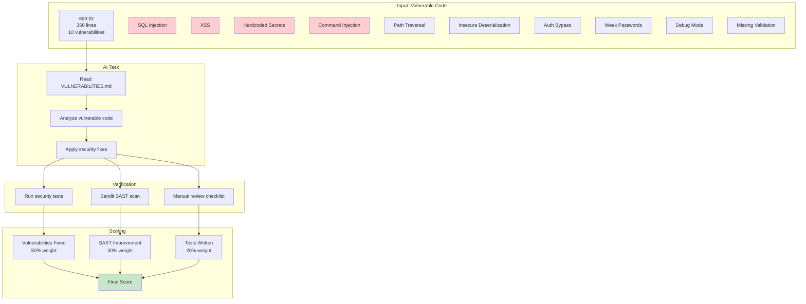

---

## Example: performance-001 Architecture

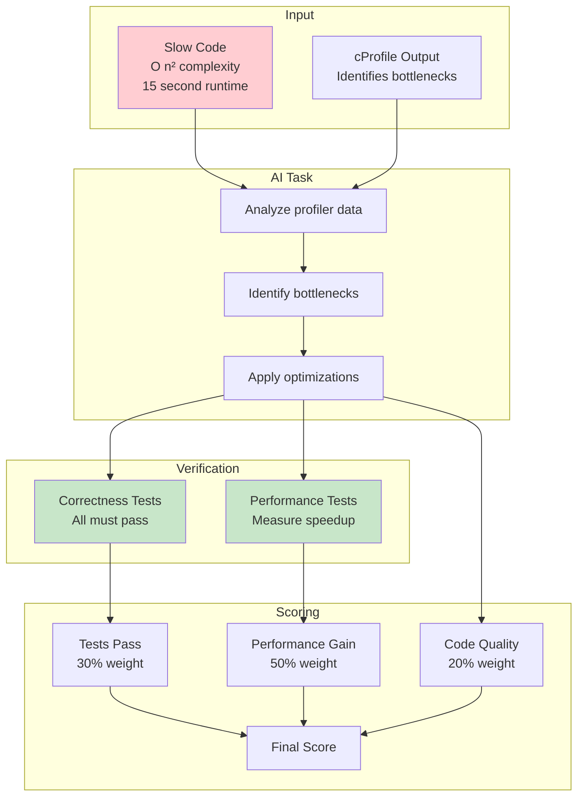

**Performance Scoring:**
- Baseline: 15 seconds
- Target: 10x speedup (1.5 seconds)
- Reference: 3,750x speedup (4ms)

---

## Leaderboard Generation Architecture

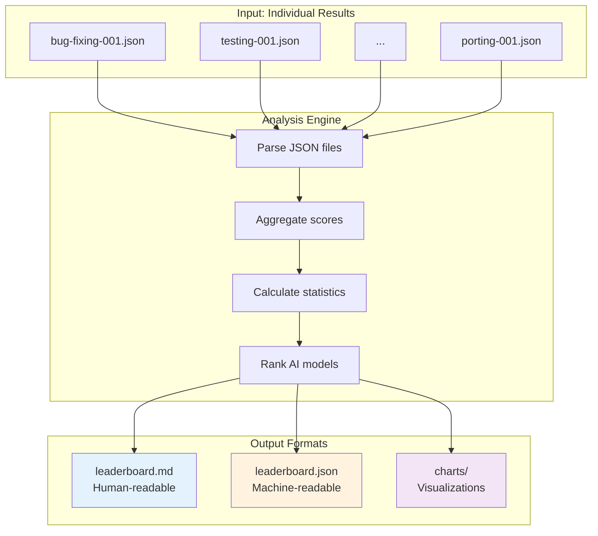

**Leaderboard Metrics:**
- Average score across all benchmarks
- Pass rate (% of benchmarks passed)
- Category breakdowns (Creation, Evolution, Quality, etc.)
- Difficulty breakdowns (Easy, Medium, Hard)
- Per-benchmark scores

---

## Development Workflow

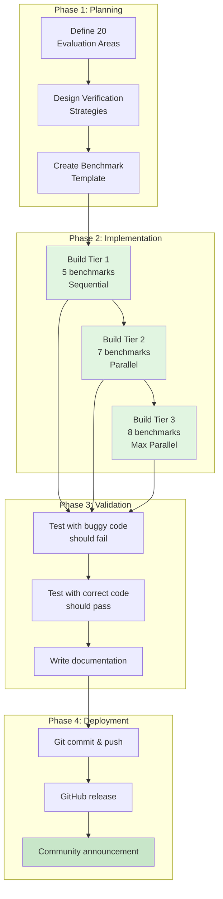

**Timeline:**
- Phase 1: 45 minutes
- Phase 2: 6 hours (4h Tier 1, 2h Tier 2+3)
- Phase 3: 1 hour
- Phase 4: 15 minutes
- **Total:** ~8 hours

---

## Sub-Agent Parallelization

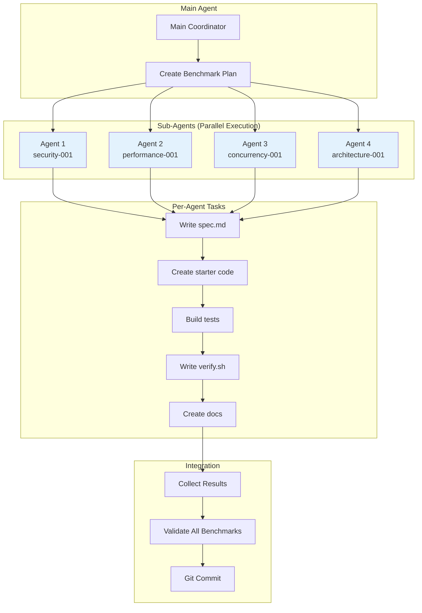

**Efficiency Gains:**
- Phase 1 (Sequential): 48 min/benchmark
- Phase 2 (2-3 parallel): 17 min/benchmark (2.8x faster)
- Phase 3 (4+ parallel): 15 min/benchmark (3.2x faster)

---

## Technology Stack

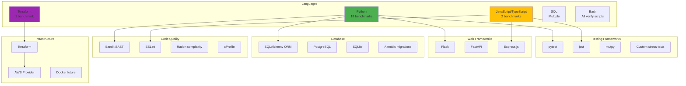

---

## Data Flow

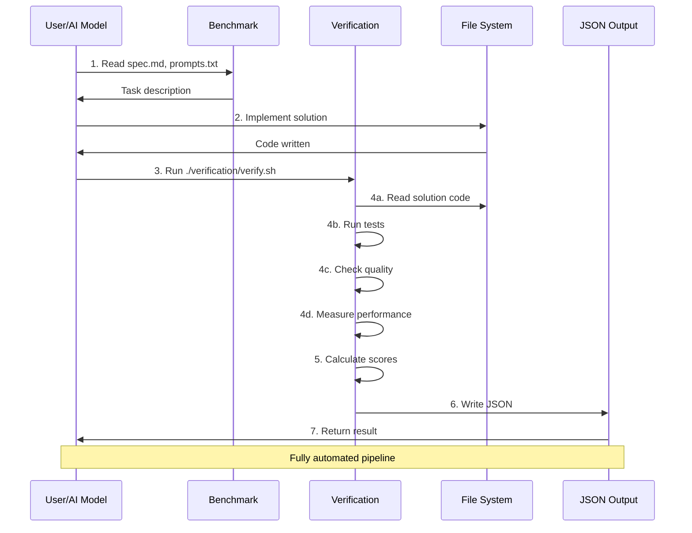

---

## Future Architecture Enhancements

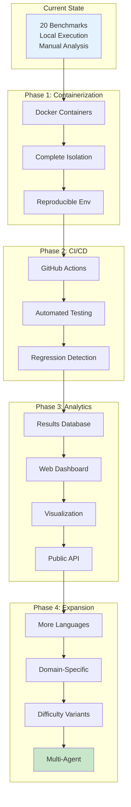

---

## Security Considerations

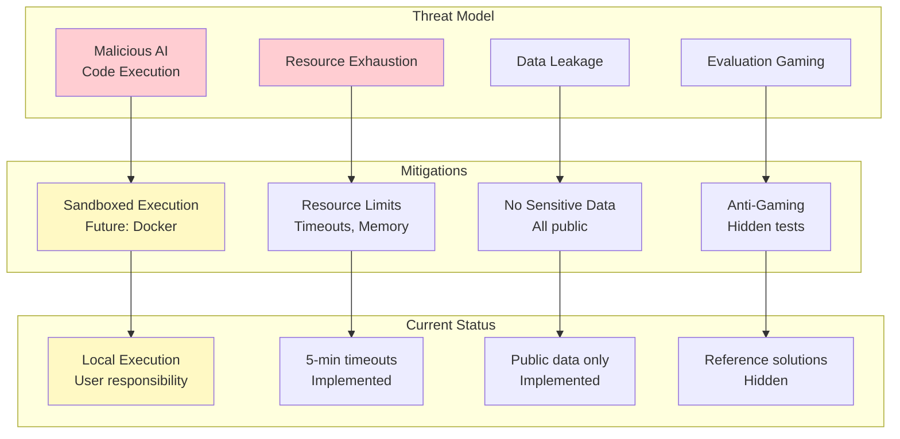

**Current Security Posture:**
- ⚠️ Local execution (user responsibility for sandboxing)
- ✅ Timeouts prevent infinite loops
- ✅ No sensitive data in benchmarks
- ✅ Reference solutions hidden from AI

**Future Improvements:**
- Docker containerization for isolation
- Resource quotas (CPU, memory, disk)
- Network isolation for security benchmarks
- Automated security scanning of submissions

---

## Extensibility

The architecture is designed for extensibility:

### Adding New Benchmarks
1. Copy `templates/benchmark-template/`
2. Customize spec.md, prompts.txt
3. Implement verification logic
4. Add to `benchmarks/` directory
5. Update documentation

### Adding New Languages
1. Create language-specific verification scripts
2. Add tooling (linters, test frameworks)
3. Update template with language examples
4. Document language-specific guidelines

### Adding New Evaluation Metrics
1. Implement metric calculation in verify.sh
2. Add component to JSON output
3. Update scoring formula if needed
4. Document metric rationale

### Integration with External Tools
- CI/CD: GitHub Actions, Jenkins
- Databases: PostgreSQL, MongoDB for results
- Dashboards: Grafana, custom web UI
- APIs: REST endpoints for submission/results

---

## Performance Characteristics

| Component | Time | Scalability |
|-----------|------|-------------|
| Single Benchmark | 1-5 min | O(1) |
| All 20 Benchmarks | 20-100 min | O(n) |
| Leaderboard Gen | <1 min | O(n×m) models |
| Sub-agent Build | 15 min | O(1) per agent |

**Bottlenecks:**
- Test execution (most time-consuming)
- Performance benchmarks (actual timing)
- LLM-as-judge (API latency)

**Optimizations:**
- Parallel test execution
- Cached results for unchanged code
- Async LLM evaluation
- Incremental verification

---

## Comparison with Other Benchmarks

```mermaid
graph TB
    subgraph "HumanEval"
        HE[164 Problems<br/>Function Writing<br/>Pass@k Metric]
    end

    subgraph "MBPP"
        MBPP[974 Problems<br/>Python Only<br/>Text Match]
    end

    subgraph "Brazil Bench"
        BB[Realistic Tasks<br/>Automated Verify<br/>Web Dev Focus]
    end

    subgraph "This Framework"
        TF[20 Benchmarks<br/>Full Lifecycle<br/>Multi-Language<br/>90% Automation<br/>Production Quality]
    end

    HE --> Narrow[Narrow Scope]
    MBPP --> Narrow
    BB --> Focused[Domain Focused]

    TF --> Comprehensive[Comprehensive<br/>Coverage]

    style TF fill:#c8e6c9
    style Comprehensive fill:#4caf50
```

**Our Differentiators:**
1. **Full lifecycle coverage** (20 areas vs narrow focus)
2. **Production quality** (realistic complexity)
3. **High automation** (>90% deterministic)
4. **Multi-language** (Python, JS/TS, Terraform)
5. **Comprehensive docs** (90+ markdown files)

---

## Conclusion

This architecture enables:
- ✅ Comprehensive AI evaluation across 20 areas
- ✅ Automated, reproducible scoring
- ✅ Extensible framework for future benchmarks
- ✅ Production-ready quality and documentation
- ✅ Rapid development (8 hours for 20 benchmarks)

The modular design, standardized structure, and automation-first approach make this the most comprehensive AI coding evaluation framework available.
