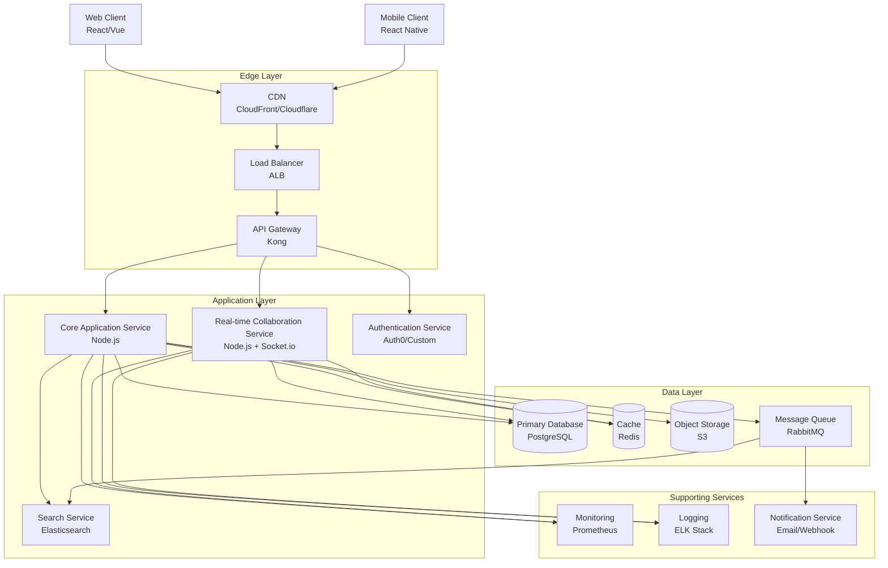

# Component Diagram

## High-Level Architecture



## Component Responsibilities

### Client Layer
- **Web Client**: Browser-based React/Vue application
- **Mobile Client**: iOS/Android React Native apps

### Edge Layer
- **CDN**: Static asset delivery, DDoS protection
- **Load Balancer**: Traffic distribution, health checks, SSL termination
- **API Gateway**: Authentication, rate limiting, request routing

### Application Layer
- **Core Application Service**:
  - Document CRUD operations
  - User and organization management
  - Permission management
  - Document exports (PDF, DOCX)
  - File uploads

- **Real-time Collaboration Service**:
  - WebSocket connection management
  - CRDT operation handling
  - Broadcast edits to connected clients
  - Presence tracking

- **Search Service**:
  - Full-text document search
  - Search indexing
  - Autocomplete

- **Authentication Service**:
  - User authentication
  - JWT token generation/validation
  - SSO integration

### Data Layer
- **PostgreSQL**: Primary data store (documents, users, orgs, permissions)
- **Redis**: Session cache, rate limiting, real-time state, pub/sub
- **S3**: Document exports, file attachments, backups
- **RabbitMQ**: Async task processing, event distribution

### Supporting Services
- **Monitoring**: Metrics collection and alerting (Prometheus + Grafana)
- **Logging**: Centralized log aggregation (ELK Stack)
- **Notification Service**: Email, webhooks, Slack/Teams integration

## Data Flow Patterns

### Synchronous (Request/Response)
```
Client → API Gateway → App Service → Database → Response
```

### Real-time (WebSocket)
```
Client A → RT Service → Redis Pub/Sub → RT Service → Client B
                     ↓
                 Database (async)
```

### Asynchronous (Event-driven)
```
App Service → Queue → Worker Service → External API/Email
```

## Service Communication

### Internal (Service-to-Service)
- HTTP/REST for synchronous calls
- Redis pub/sub for real-time coordination
- RabbitMQ for asynchronous events

### External (Client-to-Service)
- HTTPS/REST for API calls
- WebSocket for real-time updates
- GraphQL (optional future enhancement)

## Scalability Approach

- **Stateless Services**: App Service, RT Service (with Redis coordination)
- **Horizontal Scaling**: All application services auto-scale
- **Database Scaling**: Read replicas, connection pooling, sharding if needed
- **Caching**: Redis for hot data, CDN for static assets
