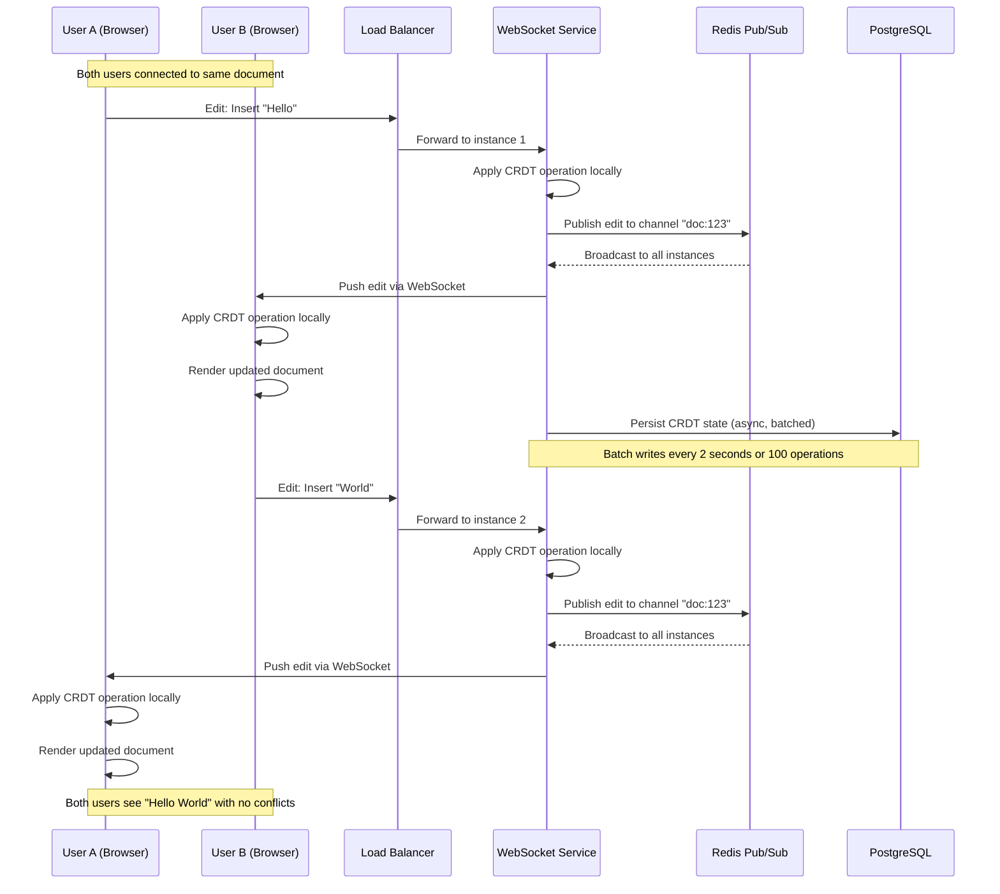
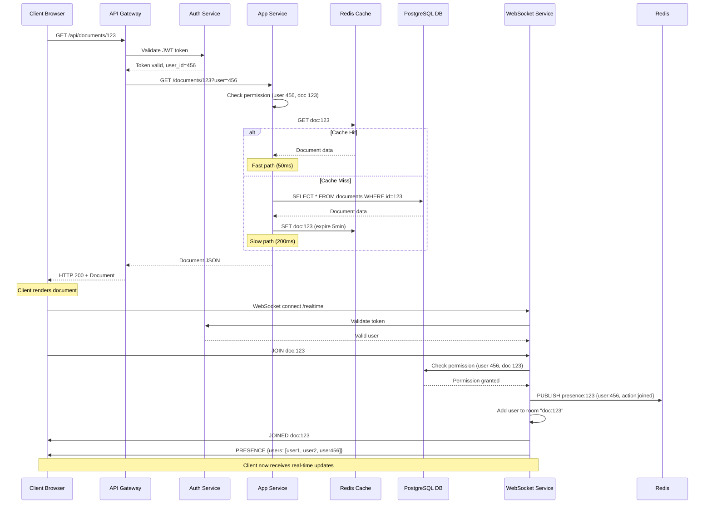
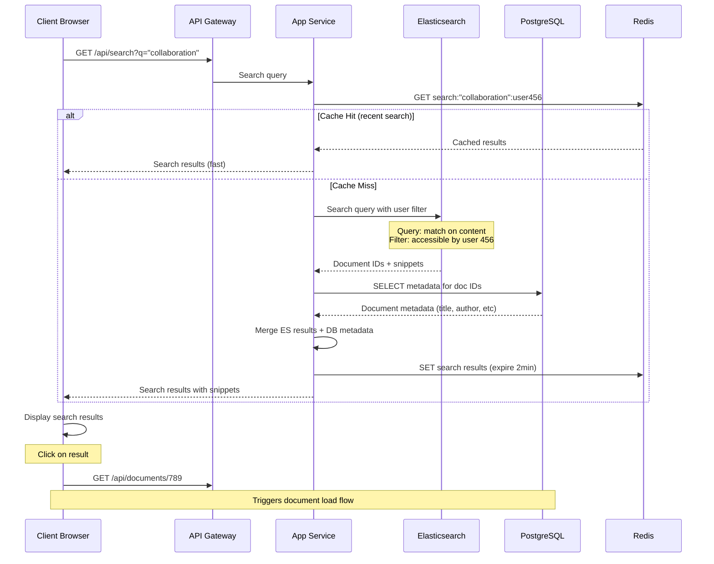
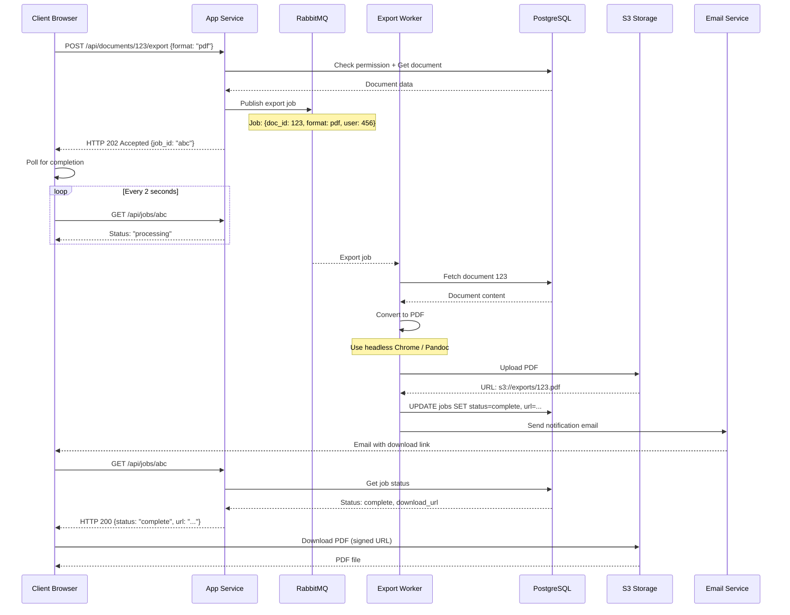
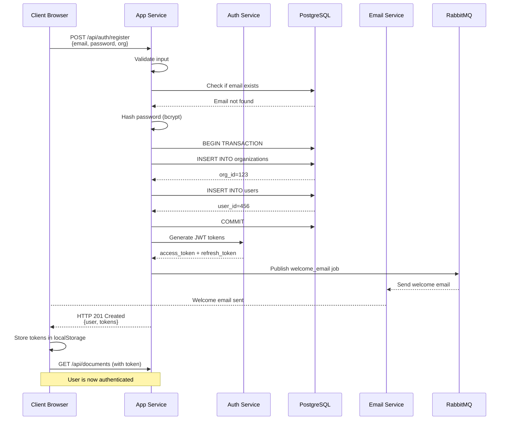
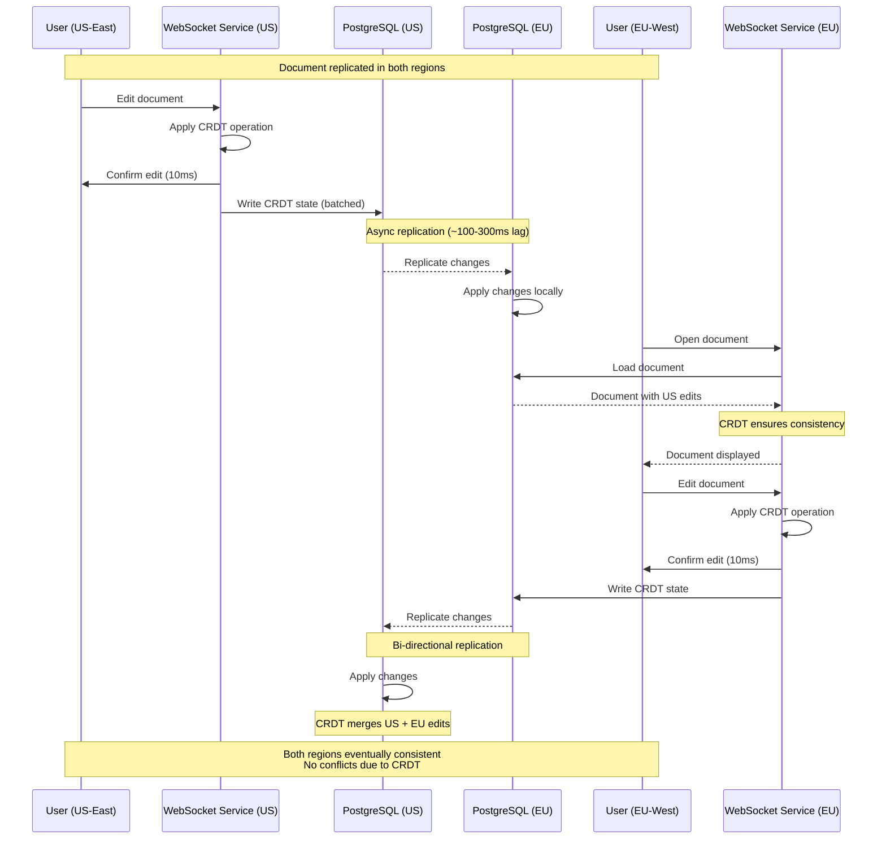

# Data Flow Diagrams

## 1. Real-time Document Edit Flow

## 2. Document Load Flow

## 3. Document Search Flow

## 4. Document Export Flow (Async)

## 5. New User Registration Flow

## 6. Cross-Region Sync Flow

## Data Flow Summary

### Synchronous Paths (User-facing)
- **Document load**: Client → Gateway → App → Cache/DB → Response (50-200ms)
- **Real-time edit**: Client → WebSocket → Redis → Other clients (10-50ms)
- **Search**: Client → App → ES → DB → Response (100-500ms)

### Asynchronous Paths (Background)
- **CRDT persistence**: WebSocket → DB (batched, 2s delay)
- **Search indexing**: DB → Queue → Worker → Elasticsearch (5-10s delay)
- **Document export**: App → Queue → Worker → S3 → Email (30-60s)
- **Cross-region sync**: DB → Replication → Remote DB (100-300ms)

### Critical Paths (Performance Focus)
1. **Real-time edit propagation**: <100ms P95 (same region)
2. **Document load**: <2s for 1MB documents
3. **Search results**: <500ms
4. **WebSocket connection**: <1s

### Failure Modes

| Path | Failure | Fallback |
|------|---------|----------|
| Real-time edit | WebSocket down | Long polling |
| Cache miss | Redis unavailable | Read from DB |
| Database write | Primary down | Failover to replica |
| Search | Elasticsearch down | Degraded mode (no search) |
| Export | Worker failure | Retry from queue |

All paths designed with graceful degradation - core functionality remains even if components fail.
