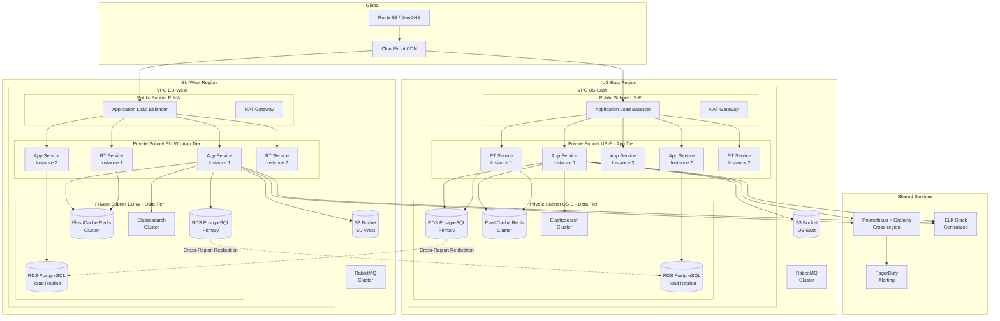

# Deployment Architecture

## Multi-Region Active-Active Deployment

## Infrastructure Details

### US-East Region (Primary)
**Compute:**
- Application Services: 3x t3.large instances (auto-scaling 2-10)
- Real-time Services: 2x t3.large instances (auto-scaling 2-8)
- Managed via AWS Auto Scaling Groups

**Database:**
- RDS PostgreSQL: db.r5.xlarge (4 vCPU, 32GB RAM)
- Read Replica: 1x db.r5.large (same region for fast reads)
- Multi-AZ enabled for high availability
- Automated backups with 7-day retention

**Cache:**
- ElastiCache Redis: 3-node cluster (cache.r5.large)
- Cluster mode enabled for scalability
- Multi-AZ with automatic failover

**Search:**
- Elasticsearch: 3-node cluster (m5.large)
- 1TB SSD storage per node
- Dedicated master nodes for cluster stability

**Message Queue:**
- RabbitMQ: 3-node cluster (t3.medium)
- Mirrored queues for durability

**Storage:**
- S3 Standard for active exports
- S3 Glacier for old document versions

### EU-West Region (Secondary)
- Same configuration as US-East
- Independent operation (active-active)
- Can survive US-East region failure

### Network Architecture

**VPC Configuration:**
- CIDR: 10.0.0.0/16 (US-East), 10.1.0.0/16 (EU-West)
- Public subnets: 10.0.1.0/24, 10.0.2.0/24 (2 AZs)
- Private subnets: 10.0.10.0/24, 10.0.11.0/24 (2 AZs)

**Security Groups:**
- ALB: Allow 443 from internet
- App Services: Allow from ALB only
- Databases: Allow from app subnets only
- Egress: Allow to internet via NAT Gateway

**VPC Peering:**
- US-East ↔ EU-West for cross-region communication
- Used for database replication and monitoring

### High Availability

**Availability Zones:**
- All services deployed across 2+ AZs
- RDS Multi-AZ automatic failover
- Redis cluster across AZs

**Health Checks:**
- ALB health checks every 30 seconds
- Auto Scaling based on health + metrics
- Unhealthy instances automatically replaced

**Database Failover:**
- RDS Multi-AZ: Automatic failover <60 seconds
- Cross-region failover: Manual (DNS switch) ~5 minutes
- Redis: Automatic failover to replica

### Disaster Recovery

**Backup Strategy:**
- Database: Daily automated snapshots, 7-day retention
- Cross-region replication to EU-West
- S3: Cross-region replication enabled
- Point-in-time recovery for databases

**Recovery Objectives:**
- RTO: 15 minutes (failover to secondary region)
- RPO: 1 minute (replication lag)

**DR Scenarios:**
1. **Single instance failure**: Auto-scaling replaces (RTO: 2 min)
2. **AZ failure**: Traffic routes to healthy AZ (RTO: <1 min)
3. **Region failure**: DNS failover to EU-West (RTO: 15 min)

### Monitoring and Observability

**Metrics (Prometheus):**
- Application metrics: Request rate, latency, errors
- System metrics: CPU, memory, disk, network
- Database metrics: Connections, query latency, replication lag
- Custom metrics: Active documents, concurrent users

**Logging (ELK Stack):**
- All application logs aggregated
- Structured JSON logging
- 30-day retention in Elasticsearch
- 1-year retention in S3

**Tracing:**
- Distributed tracing with Jaeger
- Track requests across services
- Performance bottleneck identification

**Alerting:**
- PagerDuty for critical alerts
- Slack for warnings
- On-call rotation for operations team

### Security

**Network Security:**
- Private subnets for app and data tiers
- NAT Gateway for outbound internet access
- Security groups: Principle of least privilege
- VPC flow logs enabled

**Access Control:**
- IAM roles for service access (no keys)
- Secrets Manager for credentials
- MFA required for production access
- Bastion hosts for emergency access

**Data Security:**
- TLS 1.3 for all traffic
- Database encryption at rest (KMS)
- S3 encryption at rest
- Encrypted EBS volumes

### Cost Optimization

**Compute:**
- Reserved Instances for baseline capacity (1-year)
- Spot Instances for batch processing (exports, indexing)
- Auto-scaling to match demand

**Storage:**
- S3 Lifecycle policies: Standard → IA → Glacier
- Database: Regular vacuum and analyze
- CloudFront caching to reduce origin load

**Estimated Monthly Cost (at launch):**
- Compute (EC2): $2,000
- Database (RDS): $1,500
- Cache (Redis): $500
- Search (ES): $800
- Storage (S3): $200
- Data Transfer: $500
- **Total: ~$5,500/month** (supports 10k concurrent users)

### Deployment Process

**CI/CD Pipeline:**
1. Code commit to GitHub
2. GitHub Actions runs tests
3. Build Docker images
4. Push to ECR (Elastic Container Registry)
5. Deploy to staging environment
6. Run integration tests
7. Blue-green deployment to production
8. Health check validation
9. Switch traffic to new version

**Rollback:**
- Keep previous version running (blue-green)
- Instant rollback by switching ALB target group
- Database migrations: Forward-only with backward compatibility

### Scaling Plan

**Phase 1: 0-10k Users**
- 2 app instances per region
- db.r5.large database
- Current configuration

**Phase 2: 10k-50k Users**
- 5-10 app instances per region
- db.r5.xlarge database
- Add Asia-Pacific region
- Upgrade Redis cluster

**Phase 3: 50k-100k Users**
- 10-20 app instances per region
- db.r5.2xlarge database
- Consider database sharding
- Dedicated WebSocket clusters

**Phase 4: 100k+ Users**
- Database sharding by organization_id
- Microservices decomposition
- Kubernetes for orchestration
- Multi-region active-active globally
